# Leitner Box  

*Developed in 2014* 
 

In this project, a practical tool has been developed to facilitate language learning using the C# programming language. An MS-SQLServer database has been used to store information.
The ability to record different books with the desired number of boxes with the ability to record words along with their meaning and pronunciation as flash cards in each box has been provided.
For better learning, the ability to record a photo for each word has also been provided.
 
The usage procedure is as follows: you should check the words in each box daily and if you remember the meaning of the word, click the tick mark and otherwise click the untick mark.
The program will move the words with its tick mark to the next box so that they can be studied again in the next review.
Finally, with your tick mark, the words in the last box will be moved to the archive section.
 
It is also possible to define words in different networks. Using this feature, you can create different networks for each book and network words that are related to each other.
 

<picture>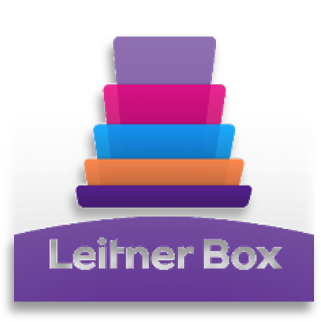</picture>  

### Compile the program
After downloading the project source, open the project in Visual Studio by clicking on the [AllLanguages.sln](AllLanguages.sln) file and compile it.
 

### App start:  
When you start the program, you will enter the program's Home page, which displays a list of registered books. 
By clicking on each book, you will enter the corresponding list boxes. 
In the image below, you can see the program's Home page, where several books have been defined as a test. 
 
<picture>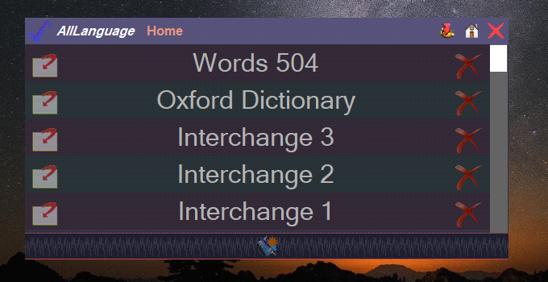</picture>

### Boxes of book: 
Below you will see the list of boxes for the book `Words 504`.
 
<picture>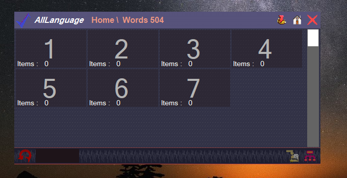</picture> 
 
Below you will see the list of boxes for the book `Oxford Dictionary`. 
 
<picture>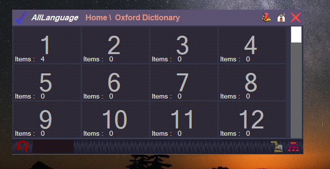</picture> 

### Vocabulary of a box:  
In the image below, you can see the list of words defined in box number `1` of the book `Oxford Dictionary`, in which several words have been recorded as a test.
 
<picture>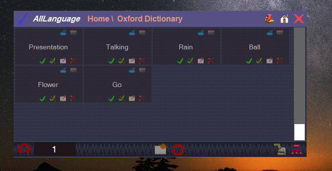</picture> 

### Sample word:  
In this section, we will examine the details of some of the registered words.

#### Rain
<picture>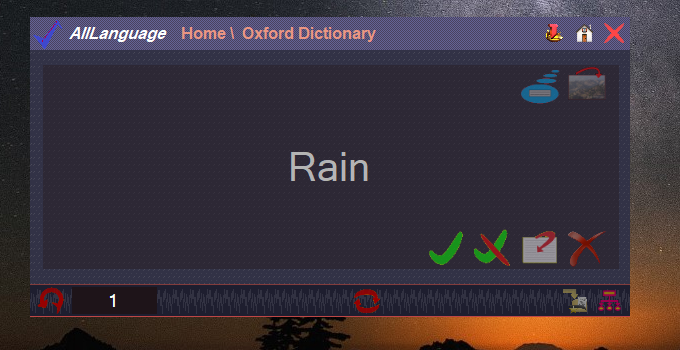</picture> 
<picture>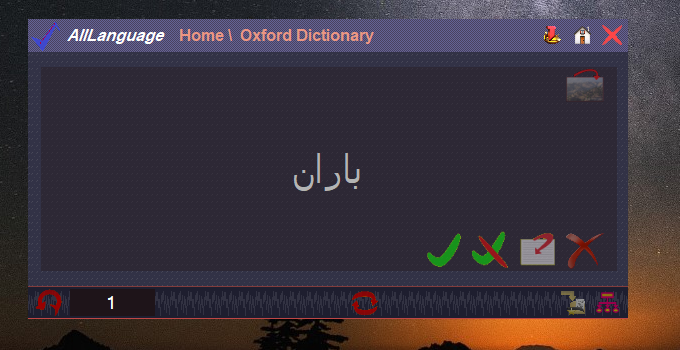</picture> 
<picture>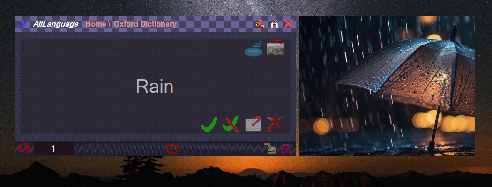</picture> 

#### Ball
<picture>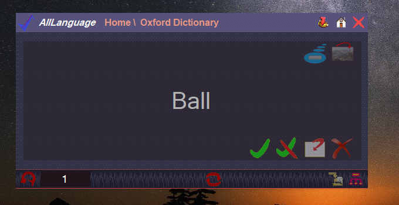</picture> 
<picture>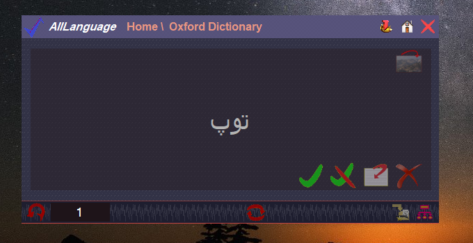</picture> 
<picture>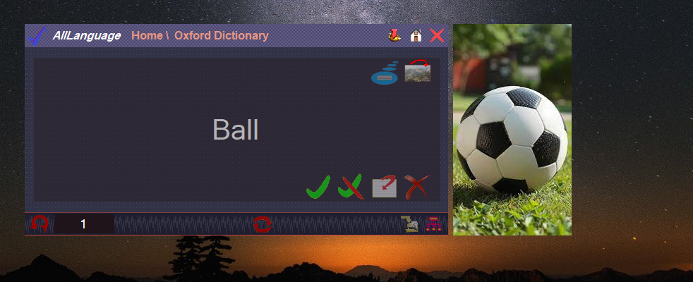</picture> 

#### Flower
<picture>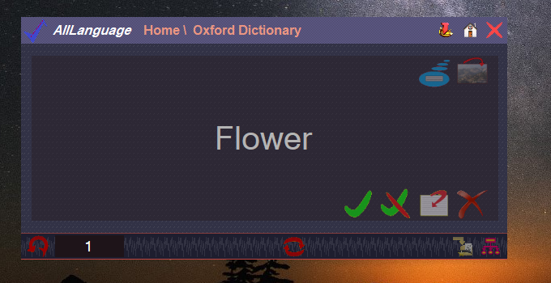</picture> 
<picture>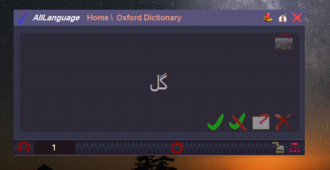</picture> 
<picture>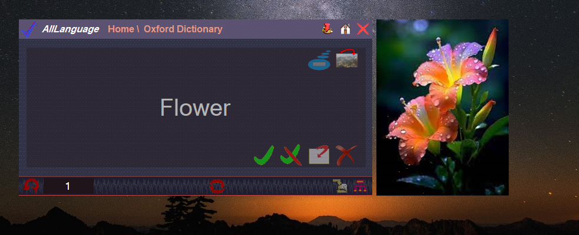</picture> 

### Archive of a book:  
<picture>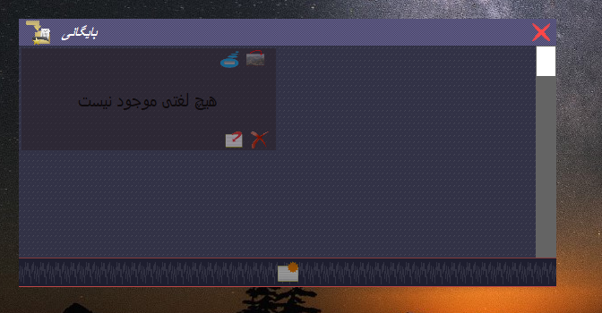</picture> 

### Networking of a book:  
<picture>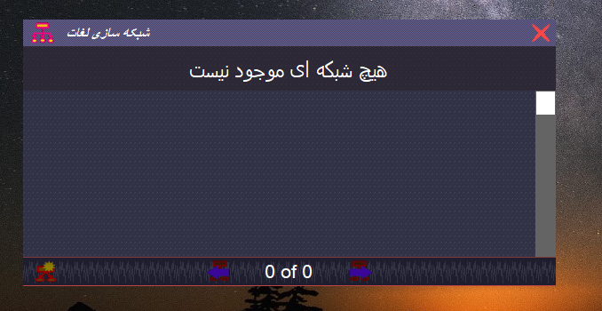</picture> 

